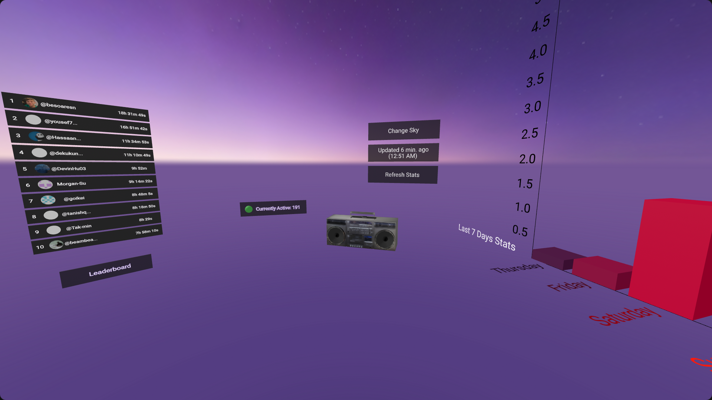

# Hackatime VR

VR implementation for visualizing Hackatime data in a virtual reality environment.

## Features

- Visualize Hackatime data in a 3D environment
- Interactive exploration of time spent on projects
- Currently Active Users visualization
- Leaderboard for top users
- Top Languages visualization
- User Overview
- Ambient Music
- Customizable Skybox
- Easter Eggs

## Author
[Arnav Kumar](https://github.com/arnav-kr)

## License
This project is licensed under the AGPL-3.0 License - see the [LICENSE](LICENSE) file for details.
